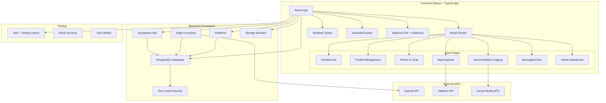
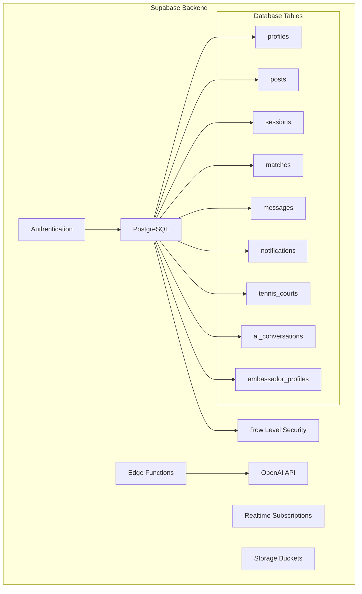
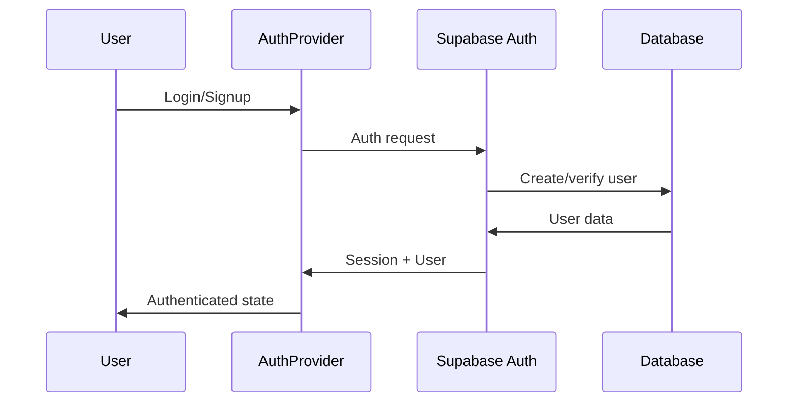
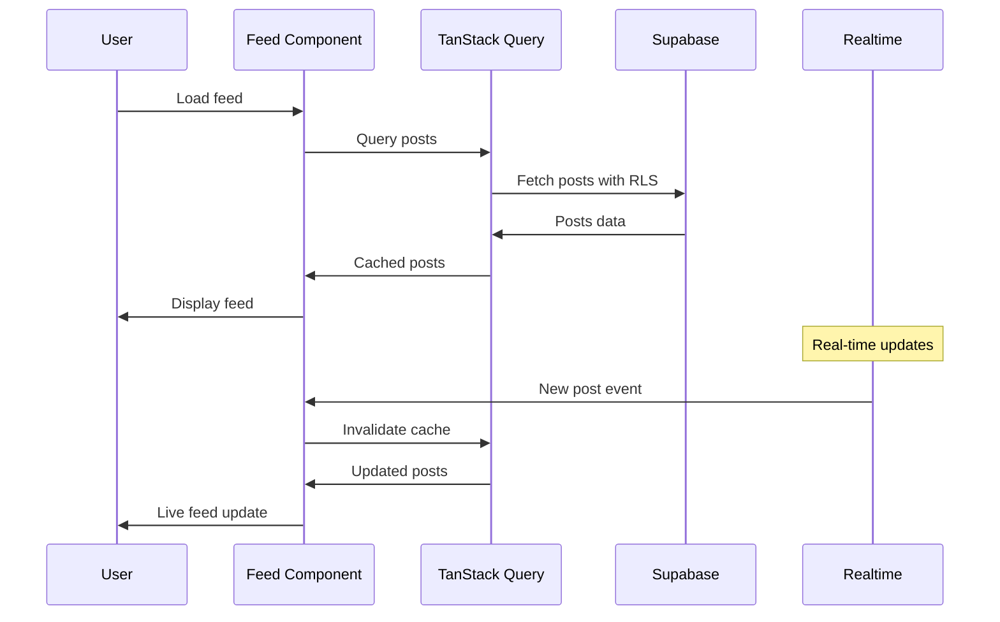
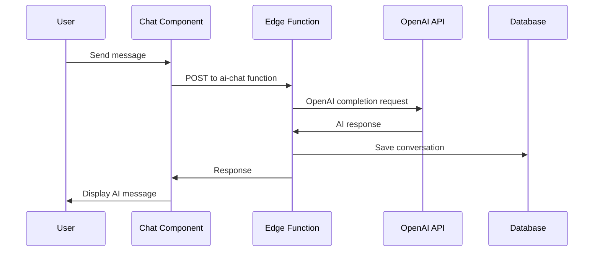
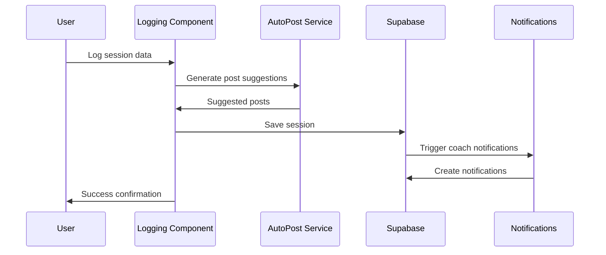
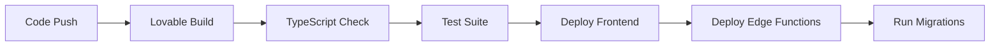

# Tennis Social Platform - Architecture Overview

## 🏗️ High-Level Architecture



## 🎯 Application Purpose

This is a comprehensive **Tennis Social Platform** that combines:
- **Social networking** for tennis players and coaches
- **Performance tracking** with session/match logging
- **AI-powered coaching** and content generation
- **Location-based discovery** of courts and players
- **Real-time messaging** and notifications
- **Admin management** tools

---

## 📱 Frontend Architecture

### Technology Stack
- **Framework**: React 18 with TypeScript
- **Routing**: React Router v6
- **State Management**: 
  - TanStack Query for server state
  - React Context for local state
  - Custom hooks for business logic
- **UI Framework**: 
  - Tailwind CSS for styling
  - shadcn/ui component library
  - Radix UI primitives
- **Build Tool**: Vite
- **Testing**: Jest + React Testing Library

### Folder Structure
```
src/
├── components/           # Reusable UI components
│   ├── ui/              # shadcn/ui base components
│   ├── admin/           # Admin-specific components
│   ├── auth/            # Authentication components
│   ├── dashboard/       # Dashboard widgets
│   ├── feed/            # Social feed components
│   ├── logging/         # Session/match logging
│   ├── map/             # Map and location features
│   ├── messages/        # Chat and messaging
│   ├── notifications/   # Notification system
│   ├── profile/         # User profile management
│   ├── social/          # Social interaction components
│   └── tennis-ai/       # AI chat interface
├── hooks/               # Custom React hooks
├── pages/               # Route-level page components
├── services/            # Business logic services
├── integrations/        # External service integrations
│   └── supabase/        # Supabase client and types
├── lib/                 # Utility functions
└── __tests__/           # Test files
```

### Component Architecture
- **Atomic Design**: Components are organized by complexity and reusability
- **Compound Components**: Complex features use compound component patterns
- **Custom Hooks**: Business logic extracted into reusable hooks
- **Service Layer**: Separation between UI and business logic

---

## 🗄️ Backend & Services

### Supabase Architecture


### Key Features
1. **Authentication**: Email/password with automatic profile creation
2. **Database**: PostgreSQL with comprehensive RLS policies
3. **Realtime**: Live updates for messages, notifications, and social feeds
4. **Edge Functions**: AI integration and external API handling
5. **Storage**: File uploads for avatars, media, and court images

### Database Design
- **User Management**: `profiles`, `user_roles`, `followers`
- **Social Features**: `posts`, `comments`, `post_reactions`, `likes`
- **Tennis Tracking**: `sessions`, `matches`, `achievements`, `certifications`
- **Location Services**: `tennis_courts` with geospatial queries
- **AI Features**: `ai_conversations`, `ai_messages`, `ambassador_profiles`
- **Communication**: `direct_messages`, `notifications`, `conversations`

---

## 🔄 Key Data Flows

### 1. User Authentication Flow


### 2. Social Feed Flow


### 3. AI Chat Flow


### 4. Session Logging Flow


---

## 🧪 Testing Architecture

### Testing Strategy
```
__tests__/
├── components/          # Component unit tests
├── hooks/              # Custom hook tests
├── services/           # Service layer tests
├── mocks/              # Mock data and utilities
│   ├── data/           # Mock data fixtures
│   └── supabase.ts     # Supabase mock
├── setup.ts            # Test configuration
└── utils/              # Test utilities
```

### Testing Patterns
- **Unit Tests**: Components, hooks, and services
- **Integration Tests**: Multi-component interactions
- **Mocking Strategy**: 
  - Supabase client fully mocked
  - External APIs mocked
  - Mock data factories for consistency
- **Coverage Areas**:
  - Authentication flows
  - Social interactions
  - AI chat functionality
  - Session/match logging
  - Map and location features

### Mock Architecture
```typescript
// Centralized Supabase mock with full query builder
const mockQueryBuilder = {
  select: jest.fn().mockReturnThis(),
  insert: jest.fn().mockReturnThis(),
  update: jest.fn().mockReturnThis(),
  delete: jest.fn().mockReturnThis(),
  eq: jest.fn().mockReturnThis(),
  // ... all query methods
};
```

---

## 🚀 Deployment & Infrastructure

### Frontend Deployment
- **Platform**: Lovable (React/Vite hosting)
- **Domain**: Custom domain support available
- **Build Process**: Automatic builds on code changes
- **Environment**: Production-ready with optimizations

### Backend Services
- **Supabase**: Managed PostgreSQL + Auth + Realtime
- **Edge Functions**: Automatically deployed with code
- **Database Migrations**: SQL-based schema management
- **Secrets Management**: Environment variables in Supabase

### CI/CD Pipeline


---

## 🔧 Configuration & Environment

### Environment Variables
- Supabase URL and keys (managed by Lovable)
- OpenAI API key (stored in Supabase secrets)
- Mapbox tokens for map features

### Feature Flags
- AI responses toggle per user
- Ambassador content system
- Location sharing privacy controls
- Admin role permissions

---

## 📊 Performance Considerations

### Frontend Optimization
- **TanStack Query**: Intelligent caching and background updates
- **Lazy Loading**: Route-based code splitting
- **Optimistic Updates**: Immediate UI feedback
- **Virtual Scrolling**: For large lists and feeds

### Backend Optimization
- **RLS Policies**: Database-level security and filtering
- **Indexes**: Optimized queries for geospatial and social data
- **Edge Functions**: Minimal cold start times
- **Realtime**: Selective subscriptions to reduce overhead

---

## 🔒 Security Model

### Authentication & Authorization
- **Row Level Security**: All tables protected by RLS
- **Role-Based Access**: Admin, coach, player roles
- **API Security**: All requests authenticated
- **Privacy Controls**: Granular location and profile settings

### Data Protection
- **Input Validation**: Zod schemas for all forms
- **SQL Injection**: Prevented by Supabase client
- **XSS Protection**: React's built-in protections
- **File Upload**: Secure storage bucket policies

---

## 🎯 Key Architectural Decisions

1. **Supabase Choice**: Provides auth, database, realtime, and edge functions in one platform
2. **React Query**: Chosen for superior caching and synchronization
3. **Component Library**: shadcn/ui for consistent, accessible components
4. **Testing Strategy**: Comprehensive mocking to avoid external dependencies
5. **Service Layer**: Separation of business logic from UI components
6. **TypeScript**: Full type safety across the entire application

This architecture supports a scalable, maintainable tennis social platform with rich features and excellent developer experience.
