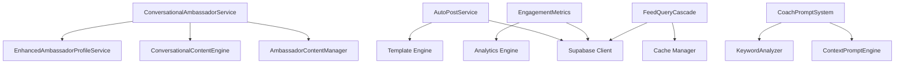

# Service Layer Architecture

## 🏗️ Service Layer Overview

The application implements a robust service layer that separates business logic from UI components. This architecture provides better testability, reusability, and maintainability.

## 📋 Service Categories

### 1. AI Services

#### `ConversationalAmbassadorService`
**Purpose**: Manages AI ambassadors that create engaging content and interact with users.

```typescript
class ConversationalAmbassadorService extends AmbassadorService {
  // Initialize AI profiles and content system
  async initializeConversationalAmbassadors(): Promise<boolean>
  
  // Start automated content rotation
  async startWeeklyContentRotation(): Promise<void>
  
  // Get system analytics
  async getConversationalStats(): Promise<Stats>
}
```

**Key Features**:
- Creates AI tennis coach personalities
- Generates realistic social content
- Schedules encouraging replies to user posts
- Weekly content drops to maintain engagement

#### `ConversationalContentEngine`
**Purpose**: Generates personality-driven content for AI ambassadors.

```typescript
class ConversationalContentEngine {
  // Content generation by personality type
  private generateContentByType(personality, contentType): string
  
  // Weekly content rotation
  generateNewWeeklyDrop(): ConversationalPost[]
  
  // Encouraging replies to user content
  generateEncouragingReply(userContent, skillLevel?): string
}
```

**Content Types**:
- **Struggles**: Relatable challenges ("Ugh, just hit my 5th ball into the net today 😅")
- **Success**: Achievement celebrations ("Finally nailed that backhand slice! 🔥")
- **Tips**: Practical advice ("Pro tip: breathe between points")
- **Questions**: Community engagement ("What's your go-to mental reset?")
- **Encouragement**: Motivational content ("Bad day on court? That's just your brain making room for tomorrow's breakthrough!")

### 2. Content & Feed Services

#### `AutoPostService`
**Purpose**: Generates personalized post suggestions from session data.

```typescript
class AutoPostService {
  // Generate posts from session data
  async generatePostSuggestions(sessionData, userId): Promise<PostSuggestion[]>
  
  // Save generated content
  async saveGeneratedPost(suggestion, userId): Promise<boolean>
}
```

**Features**:
- Template-based content generation
- Confidence scoring based on data completeness
- Privacy level suggestions
- Session data integration

#### `CoachPromptSystem`
**Purpose**: Generates coaching-specific prompts and suggestions.

```typescript
class CoachPromptSystem {
  // Generate coaching prompts based on context
  generateCoachPrompt(post, context, playerName?): CoachPrompt
  
  // Get upgrade prompts for non-coaches
  getUpgradePrompts(): Record<string, string>
}
```

**Prompt Types**:
- **Analyze**: For positive performance posts
- **Encourage**: For struggling players
- **Instruct**: For technique questions
- **Question**: For general engagement

### 3. Data & Analytics Services

#### `EngagementMetrics`
**Purpose**: Tracks and analyzes user engagement patterns.

```typescript
class EngagementMetrics {
  // Record user interactions
  async trackEngagement(userId, type, data): Promise<void>
  
  // Get user activity analytics
  async getUserEngagement(userId, timeframe): Promise<EngagementData>
  
  // Platform-wide metrics
  async getPlatformMetrics(): Promise<PlatformStats>
}
```

**Tracked Metrics**:
- Post interactions (likes, comments, reactions)
- Session logging frequency
- AI chat usage
- Coach-student interactions

#### `FeedQueryCascade`
**Purpose**: Optimizes feed queries with intelligent caching.

```typescript
class FeedQueryCascade {
  // Build personalized user feeds
  async buildUserFeed(userId, options): Promise<Post[]>
  
  // Cache management
  invalidateUserCache(userId): void
  clearCache(): void
  getCacheStats(): CacheStats
}
```

**Optimization Features**:
- Multi-tier caching strategy
- Intelligent cache invalidation
- Feed personalization
- Performance monitoring

### 4. AI Chat Services

#### `KeywordAnalyzer`
**Purpose**: Analyzes content for context and sentiment.

```typescript
class KeywordAnalyzer {
  // Extract tennis-specific keywords
  static analyzeContent(content): KeywordMatch[]
  
  // Determine emotional tone
  static getEmotionalTone(content): 'positive' | 'negative' | 'neutral'
  
  // Detect performance indicators
  static hasPerformanceIndicators(content): boolean
}
```

**Analysis Categories**:
- **Technical**: Technique, grip, footwork
- **Mental**: Confidence, nerves, motivation
- **Tactical**: Strategy, placement, game plans
- **Physical**: Fitness, endurance, strength

#### `ContextPromptEngine`
**Purpose**: Generates contextual AI prompts based on user state.

```typescript
class ContextPromptEngine {
  // Generate context-aware prompts
  generatePrompt(context): PromptData
  
  // Expertise-specific prompts
  private getExpertisePrompts(area): string[]
}
```

### 5. Supporting Services

#### `PreviewService`
**Purpose**: Manages post previews and draft content.

```typescript
class PreviewService {
  // Generate post previews
  async generatePreview(content, privacy): Promise<PreviewData>
  
  // Save draft content
  async saveDraft(userId, content): Promise<string>
  
  // Load user drafts
  async getUserDrafts(userId): Promise<Draft[]>
}
```

#### `AlertEngine`
**Purpose**: Manages intelligent notifications and alerts.

```typescript
class AlertEngine {
  // Create smart alerts for coaches
  async createAlert(type, data): Promise<Alert>
  
  // Process alert rules
  private processAlertRules(studentData): AlertTrigger[]
  
  // Send notifications
  async sendAlert(alert, recipients): Promise<boolean>
}
```

**Alert Types**:
- Student performance drops
- Missed training sessions
- Achievement milestones
- Technique improvements

## 🔄 Service Integration Patterns

### 1. Singleton Pattern
```typescript
class ServiceName {
  private static instance: ServiceName;
  
  static getInstance(): ServiceName {
    if (!this.instance) {
      this.instance = new ServiceName();
    }
    return this.instance;
  }
}
```

**Benefits**:
- Consistent state across components
- Resource efficiency
- Simplified dependency injection

### 2. Observer Pattern
```typescript
// Services can subscribe to events
class EngagementMetrics {
  constructor() {
    EventBus.subscribe('post_created', this.trackPostCreation);
    EventBus.subscribe('reaction_added', this.trackReaction);
  }
}
```

### 3. Strategy Pattern
```typescript
// Different content generation strategies
class ConversationalContentEngine {
  private strategies = {
    encouraging: new EncouragingStrategy(),
    analytical: new AnalyticalStrategy(),
    humorous: new HumorousStrategy(),
  };
  
  generateContent(personality, type) {
    return this.strategies[personality.tone].generate(type);
  }
}
```

## 🧪 Testing Strategy

### Service Mocking
```typescript
// Comprehensive service mocks
jest.mock('@/services/ConversationalAmbassadorService', () => ({
  ConversationalAmbassadorService: {
    getInstance: jest.fn(() => ({
      initializeConversationalAmbassadors: jest.fn(),
      getConversationalStats: jest.fn(() => mockStats),
    })),
  },
}));
```

### Mock Data Factories
```typescript
// Consistent test data
const mockPosts = {
  standard: () => ({ id: 'post-1', content: 'Test content', ... }),
  withMedia: () => ({ ...standard(), media_url: 'test.jpg' }),
  private: () => ({ ...standard(), privacy_level: 'private' }),
};
```

### Integration Testing
```typescript
describe('Service Integration', () => {
  it('generates and saves auto-posts', async () => {
    const autoPostService = AutoPostService.getInstance();
    const suggestions = await autoPostService.generatePostSuggestions(sessionData, userId);
    const saved = await autoPostService.saveGeneratedPost(suggestions[0], userId);
    expect(saved).toBe(true);
  });
});
```

## 📊 Performance Considerations

### Caching Strategy
```typescript
class FeedQueryCascade {
  private cache = new Map<string, CachedFeed>();
  private readonly TTL = 5 * 60 * 1000; // 5 minutes
  
  async buildUserFeed(userId: string): Promise<Post[]> {
    const cached = this.cache.get(userId);
    if (cached && !this.isExpired(cached)) {
      return cached.data;
    }
    
    const fresh = await this.fetchFreshFeed(userId);
    this.cache.set(userId, { data: fresh, timestamp: Date.now() });
    return fresh;
  }
}
```

### Background Processing
```typescript
class ConversationalAmbassadorService {
  async startWeeklyContentRotation(): Promise<void> {
    // Non-blocking content generation
    setInterval(async () => {
      await this.contentManager.performWeeklyContentDrop();
    }, 7 * 24 * 60 * 60 * 1000); // Weekly
  }
}
```

### Database Optimization
```typescript
// Efficient queries with proper indexing
class EngagementMetrics {
  async getUserEngagement(userId: string): Promise<EngagementData> {
    const { data } = await supabase
      .from('engagement_metrics')
      .select('*')
      .eq('user_id', userId)
      .gte('created_at', oneWeekAgo)
      .order('created_at', { ascending: false });
    
    return this.aggregateMetrics(data);
  }
}
```

## 🔗 Service Dependencies

### Dependency Graph


### Service Communication
- **Direct Injection**: Services access others through getInstance()
- **Event-Driven**: Some services communicate via events
- **Shared State**: Supabase client shared across all services
- **Error Handling**: Consistent error patterns across services

## 🛠️ Configuration & Environment

### Service Configuration
```typescript
interface ServiceConfig {
  cacheEnabled: boolean;
  cacheTTL: number;
  batchSize: number;
  retryAttempts: number;
}

class BaseService {
  constructor(protected config: ServiceConfig) {}
}
```

### Environment-Specific Behavior
```typescript
class ConversationalAmbassadorService {
  constructor() {
    // Different behavior in development vs production
    this.isProduction = process.env.NODE_ENV === 'production';
    this.contentDropInterval = this.isProduction ? 7 * 24 * 60 * 60 * 1000 : 60 * 1000;
  }
}
```

This service layer architecture provides a solid foundation for a scalable, maintainable tennis social platform with clear separation of concerns and comprehensive testing capabilities.
