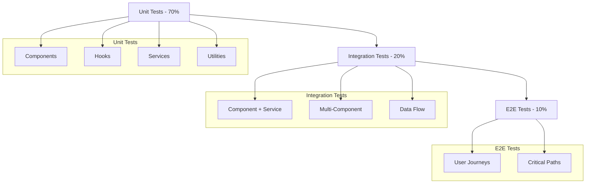

# Testing Strategy & Architecture

## 🧪 Testing Philosophy

The application follows a comprehensive testing strategy focused on reliability, maintainability, and developer confidence. Tests are organized to provide fast feedback loops and catch regressions early.

## 📊 Testing Pyramid



## 🏗️ Test Infrastructure

### Technology Stack
- **Test Runner**: Jest
- **React Testing**: React Testing Library
- **Mocking**: Jest mocks + MSW (Mock Service Worker)
- **Coverage**: Istanbul (built into Jest)
- **Utilities**: Custom test utilities for common patterns

### Test Configuration
```typescript
// jest.config.js
export default {
  testEnvironment: 'jsdom',
  setupFilesAfterEnv: ['<rootDir>/src/__tests__/setup.ts'],
  moduleNameMapping: {
    '^@/(.*)$': '<rootDir>/src/$1',
  },
  collectCoverageFrom: [
    'src/**/*.{ts,tsx}',
    '!src/**/*.d.ts',
    '!src/**/*.stories.tsx',
  ],
  coverageThresholds: {
    global: {
      branches: 80,
      functions: 80,
      lines: 80,
      statements: 80,
    },
  },
};
```

## 🧩 Component Testing

### Testing Patterns
```typescript
// Standard component test structure
describe('ComponentName', () => {
  const defaultProps = {
    // Required props with sensible defaults
  };

  const renderComponent = (props = {}) => {
    return render(
      <ComponentName {...defaultProps} {...props} />,
      { wrapper: TestWrapper }
    );
  };

  describe('Rendering', () => {
    it('displays expected content', () => {
      renderComponent();
      expect(screen.getByText('Expected Text')).toBeInTheDocument();
    });
  });

  describe('Interactions', () => {
    it('handles user interactions', async () => {
      const mockHandler = jest.fn();
      renderComponent({ onAction: mockHandler });
      
      await user.click(screen.getByRole('button'));
      expect(mockHandler).toHaveBeenCalledWith(expectedData);
    });
  });

  describe('Edge Cases', () => {
    it('handles loading state', () => {
      renderComponent({ loading: true });
      expect(screen.getByRole('progressbar')).toBeInTheDocument();
    });

    it('handles error state', () => {
      renderComponent({ error: 'Something went wrong' });
      expect(screen.getByText('Something went wrong')).toBeInTheDocument();
    });
  });
});
```

### Complex Component Testing
```typescript
// Multi-step forms and wizards
describe('SessionLogger', () => {
  it('completes full session logging flow', async () => {
    const mockSubmit = jest.fn();
    renderComponent({ onSubmit: mockSubmit });

    // Step 1: Basic info
    await user.type(screen.getByLabelText('Session Date'), '2024-01-15');
    await user.click(screen.getByText('Next'));

    // Step 2: Drills
    await user.click(screen.getByText('Add Drill'));
    await user.type(screen.getByLabelText('Drill Name'), 'Forehand Practice');
    await user.click(screen.getByText('Next'));

    // Final submission
    await user.click(screen.getByText('Save Session'));
    
    expect(mockSubmit).toHaveBeenCalledWith({
      sessionDate: '2024-01-15',
      drills: [{ name: 'Forehand Practice' }],
    });
  });
});
```

## 🔗 Hook Testing

### Custom Hook Testing Strategy
```typescript
// Hook testing with React Testing Library
describe('useSessionSubmit', () => {
  const renderHook = () => {
    return renderHook(() => useSessionSubmit(), {
      wrapper: ({ children }) => (
        <QueryClientProvider client={testQueryClient}>
          <AuthProvider>
            {children}
          </AuthProvider>
        </QueryClientProvider>
      ),
    });
  };

  it('submits session data successfully', async () => {
    const { result } = renderHook();
    
    const sessionData = mockSessionData();
    
    await act(async () => {
      await result.current.submitSession(sessionData);
    });

    expect(result.current.isLoading).toBe(false);
    expect(result.current.error).toBe(null);
    expect(mockSupabase.from).toHaveBeenCalledWith('sessions');
  });

  it('handles submission errors', async () => {
    mockSupabase.from.mockReturnValueOnce(
      createMockQueryBuilder({ error: new Error('Network error') })
    );

    const { result } = renderHook();
    
    await act(async () => {
      await result.current.submitSession(mockSessionData());
    });

    expect(result.current.error).toEqual('Network error');
  });
});
```

## 🛠️ Service Layer Testing

### Service Testing Patterns
```typescript
describe('AutoPostService', () => {
  let autoPostService: AutoPostService;

  beforeEach(() => {
    jest.clearAllMocks();
    autoPostService = AutoPostService.getInstance();
  });

  describe('generatePostSuggestions', () => {
    it('generates suggestions from session data', async () => {
      // Setup mock data
      const mockTemplates = [createMockTemplate()];
      mockSupabase.from.mockReturnValue(
        createMockQueryBuilder({ data: mockTemplates })
      );

      const sessionData = createMockSessionData();
      const suggestions = await autoPostService.generatePostSuggestions(
        sessionData, 
        'user-123'
      );

      expect(suggestions).toHaveLength(1);
      expect(suggestions[0]).toMatchObject({
        content: expect.stringContaining(sessionData.focus_areas[0]),
        confidence: expect.any(Number),
        privacyLevel: 'public',
      });
    });

    it('handles database errors gracefully', async () => {
      mockSupabase.from.mockReturnValue(
        createMockQueryBuilder({ error: new Error('DB Error') })
      );

      const suggestions = await autoPostService.generatePostSuggestions(
        createMockSessionData(),
        'user-123'
      );

      expect(suggestions).toEqual([]);
    });
  });
});
```

### Mock Factory Patterns
```typescript
// Centralized mock factories for consistency
export const mockFactories = {
  user: (overrides = {}) => ({
    id: 'user-123',
    email: 'test@example.com',
    full_name: 'Test User',
    user_type: 'player',
    ...overrides,
  }),

  session: (overrides = {}) => ({
    id: 'session-123',
    user_id: 'user-123',
    session_date: new Date(),
    focus_areas: ['technique'],
    drills: [{ name: 'forehand', rating: 8 }],
    ...overrides,
  }),

  post: (overrides = {}) => ({
    id: 'post-123',
    user_id: 'user-123',
    content: 'Test post content',
    privacy_level: 'public',
    created_at: new Date().toISOString(),
    ...overrides,
  }),
};
```

## 🗄️ Database Mocking Strategy

### Supabase Client Mock
```typescript
// Comprehensive Supabase mock
const createMockQueryBuilder = (response = {}) => ({
  select: jest.fn().mockReturnThis(),
  insert: jest.fn().mockReturnThis(),
  update: jest.fn().mockReturnThis(),
  delete: jest.fn().mockReturnThis(),
  eq: jest.fn().mockReturnThis(),
  neq: jest.fn().mockReturnThis(),
  in: jest.fn().mockReturnThis(),
  gte: jest.fn().mockReturnThis(),
  lte: jest.fn().mockReturnThis(),
  order: jest.fn().mockReturnThis(),
  limit: jest.fn().mockReturnThis(),
  single: jest.fn().mockReturnThis(),
  maybeSingle: jest.fn().mockReturnThis(),
  then: jest.fn().mockResolvedValue(response),
});

export const mockSupabase = {
  auth: {
    getSession: jest.fn(),
    signInWithPassword: jest.fn(),
    signUp: jest.fn(),
    signOut: jest.fn(),
    onAuthStateChange: jest.fn(),
  },
  from: jest.fn(() => createMockQueryBuilder()),
  rpc: jest.fn(() => createMockQueryBuilder()),
  channel: jest.fn(() => ({
    on: jest.fn().mockReturnThis(),
    subscribe: jest.fn(),
  })),
  storage: {
    from: jest.fn(() => ({
      upload: jest.fn(),
      download: jest.fn(),
      getPublicUrl: jest.fn(),
    })),
  },
};
```

### Database State Management
```typescript
// Test database state for consistent testing
class TestDatabaseState {
  private state = {
    users: new Map(),
    posts: new Map(),
    sessions: new Map(),
  };

  addUser(user: User) {
    this.state.users.set(user.id, user);
    return user;
  }

  getUser(id: string) {
    return this.state.users.get(id);
  }

  clear() {
    this.state.users.clear();
    this.state.posts.clear();
    this.state.sessions.clear();
  }
}

const testDb = new TestDatabaseState();
```

## 🔄 Integration Testing

### Component + Service Integration
```typescript
describe('Social Feed Integration', () => {
  it('displays posts and handles interactions', async () => {
    // Setup test data
    const mockPosts = [mockFactories.post(), mockFactories.post()];
    mockSupabase.from.mockReturnValue(
      createMockQueryBuilder({ data: mockPosts })
    );

    // Render component
    render(<Feed />, { wrapper: TestWrapper });

    // Wait for posts to load
    await waitFor(() => {
      expect(screen.getByText(mockPosts[0].content)).toBeInTheDocument();
    });

    // Test interaction
    const likeButton = screen.getAllByRole('button', { name: /like/i })[0];
    await user.click(likeButton);

    // Verify service call
    expect(mockSupabase.from).toHaveBeenCalledWith('post_reactions');
  });
});
```

### Multi-Component Workflows
```typescript
describe('Session Logging to Feed', () => {
  it('logs session and creates auto-post', async () => {
    render(<SessionLoggerPage />, { wrapper: TestWrapper });

    // Fill out session form
    await user.type(screen.getByLabelText('Session Note'), 'Great practice today!');
    await user.click(screen.getByText('Save Session'));

    // Verify session saved
    await waitFor(() => {
      expect(mockSupabase.from).toHaveBeenCalledWith('sessions');
    });

    // Navigate to feed
    await user.click(screen.getByText('View in Feed'));

    // Verify auto-generated post appears
    await waitFor(() => {
      expect(screen.getByText(/Great practice today/)).toBeInTheDocument();
    });
  });
});
```

## 🎯 Error Handling Testing

### Error Boundary Testing
```typescript
describe('Error Boundaries', () => {
  it('catches and displays component errors', () => {
    const ThrowError = () => {
      throw new Error('Test error');
    };

    render(
      <ErrorBoundary>
        <ThrowError />
      </ErrorBoundary>
    );

    expect(screen.getByText(/something went wrong/i)).toBeInTheDocument();
  });
});
```

### Network Error Simulation
```typescript
describe('Network Error Handling', () => {
  it('handles failed API requests', async () => {
    // Simulate network failure
    mockSupabase.from.mockReturnValue(
      createMockQueryBuilder({ 
        error: { message: 'Network timeout' } 
      })
    );

    render(<UserProfile userId="123" />, { wrapper: TestWrapper });

    await waitFor(() => {
      expect(screen.getByText(/failed to load profile/i)).toBeInTheDocument();
    });
  });
});
```

## 📊 Performance Testing

### Render Performance
```typescript
describe('Performance', () => {
  it('renders large lists efficiently', () => {
    const largeMockData = Array.from({ length: 1000 }, (_, i) => 
      mockFactories.post({ id: `post-${i}`, content: `Post ${i}` })
    );

    const startTime = performance.now();
    
    render(<PostList posts={largeMockData} />, { wrapper: TestWrapper });
    
    const endTime = performance.now();
    expect(endTime - startTime).toBeLessThan(100); // Less than 100ms
  });
});
```

## 🔧 Test Utilities

### Custom Render Function
```typescript
// Enhanced render with common providers
interface RenderOptions {
  initialEntries?: string[];
  user?: User;
  queryClient?: QueryClient;
}

export const renderWithProviders = (
  ui: ReactElement,
  options: RenderOptions = {}
) => {
  const {
    initialEntries = ['/'],
    user = null,
    queryClient = createTestQueryClient(),
  } = options;

  const Wrapper = ({ children }: { children: ReactNode }) => (
    <BrowserRouter>
      <QueryClientProvider client={queryClient}>
        <AuthProvider initialUser={user}>
          {children}
        </AuthProvider>
      </QueryClientProvider>
    </BrowserRouter>
  );

  return {
    ...render(ui, { wrapper: Wrapper }),
    queryClient,
  };
};
```

### Common Assertions
```typescript
// Custom matchers for tennis-specific testing
expect.extend({
  toBeValidTennisScore(received) {
    const scorePattern = /^\d+-\d+(\s+\d+-\d+)*$/;
    return {
      message: () => `Expected ${received} to be a valid tennis score`,
      pass: scorePattern.test(received),
    };
  },

  toHaveReactionCount(element, reactionType, expectedCount) {
    const reactionButton = element.querySelector(`[data-reaction="${reactionType}"]`);
    const count = parseInt(reactionButton?.textContent || '0');
    return {
      message: () => `Expected ${reactionType} count to be ${expectedCount}, got ${count}`,
      pass: count === expectedCount,
    };
  },
});
```

## 📈 Coverage & Quality Metrics

### Coverage Configuration
```typescript
// Comprehensive coverage tracking
const coverageConfig = {
  branches: 80,    // Conditional branches
  functions: 80,   // Function coverage
  lines: 80,       // Line coverage
  statements: 80,  // Statement coverage
};

// Exclude from coverage
const excludePatterns = [
  '**/*.d.ts',           // Type definitions
  '**/*.stories.tsx',    // Storybook stories
  '**/mocks/**',         // Mock files
  '**/test-utils/**',    // Test utilities
];
```

### Quality Gates
```typescript
// Pre-commit hooks with Husky
{
  "scripts": {
    "test:coverage": "jest --coverage --watchAll=false",
    "test:ci": "jest --ci --coverage --watchAll=false",
    "lint": "eslint src --ext .ts,.tsx",
    "type-check": "tsc --noEmit"
  },
  "husky": {
    "hooks": {
      "pre-commit": "npm run lint && npm run type-check && npm run test:coverage"
    }
  }
}
```

## 🚀 Continuous Integration

### GitHub Actions Pipeline
```yaml
name: Test Suite
on: [push, pull_request]

jobs:
  test:
    runs-on: ubuntu-latest
    steps:
      - uses: actions/checkout@v2
      - uses: actions/setup-node@v2
        with:
          node-version: '18'
      
      - name: Install dependencies
        run: npm ci
      
      - name: Run type check
        run: npm run type-check
      
      - name: Run linter
        run: npm run lint
      
      - name: Run tests
        run: npm run test:ci
      
      - name: Upload coverage
        uses: codecov/codecov-action@v1
```

This comprehensive testing strategy ensures high code quality, catches regressions early, and provides confidence for continuous deployment of the tennis social platform.
